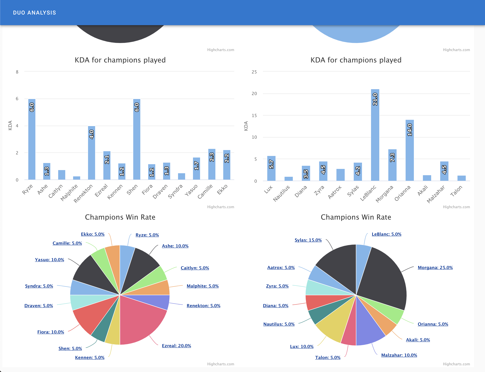

### Duo Analysis

[Duo-Analysis](https://github.com/CodingFatty/vue-lol-duo-partner) is a web application that let people compare two summoners' performance on their games.

##### Tech Stacks

- Frontend: Vuejs, highcharts
    - Call Nodejs server to fetch data from RiotGame Api
    - Use highcharts library to visualize the data
    - Hosted on Firebase
- Backend: Nodejs, Express, axios, MongoDB
    - Fetch summoners information from RiotGame Api
    - Save data into MongoDB
    - Extract necessary data and pass it to response
    - Hosted on Heroku
- Database: MongoDB
    - Access data through Mongoose
    - Hosted on mLab
